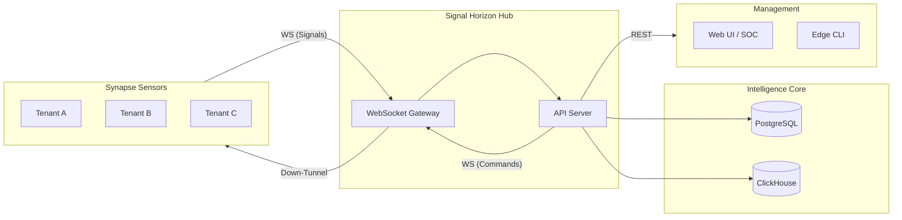

# Signal Horizon Architecture Patterns

This document describes the system architecture and core design patterns used in the Signal Horizon Hub.

## System Overview

Signal Horizon is a multi-tenant hub that ingests threat signals from Synapse sensors, correlates them into campaigns and threats, and distributes intel to dashboards and the fleet.

High-level components:

Key internal services:

- Sensor Gateway (WebSocket ingestion)
- Aggregator (batching, dedupe, anonymization)
- Correlator (cross-tenant campaign detection)
- Broadcaster (real-time dashboard push + blocklist automation)
- Hunt Service (time-based queries, Postgres/ClickHouse routing)
- Intel Service (IOC export and trends)
- War Room Service (incident collaboration + activity log)
- Fleet Management Services (metrics, config, commands, rules)

## Core Data Flow Patterns

### 1) Streaming Ingest Pipeline (Sensors -> Hub)

**Pattern**: WebSocket ingestion with backpressure, batch processing, and dual-write.

1. Sensors authenticate to `/ws/sensors` using `signal:write` API keys.
2. Sensors submit `signal` or `signal-batch` messages.
3. Aggregator queues signals, deduplicates, and enriches with tenant/sensor context.
4. Signals are stored in PostgreSQL (source of truth).
5. Optional async write to ClickHouse for historical analytics.
6. Correlator detects cross-tenant campaigns based on anonymized fingerprints.
7. Broadcaster notifies dashboards and auto-creates blocklist entries when needed.

Key patterns:
- **Backpressure**: Aggregator enforces a max queue size to prevent memory exhaustion.
- **Batching**: Flushes at `batchSize` or `batchTimeoutMs`.
- **Deduplication**: Merges signals by `signalType + (sourceIp or fingerprint)`.
- **Dual-write**: Postgres is authoritative; ClickHouse writes are non-blocking.

### 2) Real-Time Push (Hub -> Dashboards)

**Pattern**: Publish/subscribe topics over WebSocket.

- Dashboards authenticate with `dashboard:read` scope on `/ws/dashboard`.
- Server assigns default subscriptions: `campaigns`, `threats`, `blocklist`.
- Broadcaster emits alert messages (campaign, threat, blocklist) to subscribed clients.
- Dashboards can request snapshots or subscribe/unsubscribe to topics.

### 3) Fleet Command and Control

**Pattern**: REST-triggered command orchestration with WebSocket delivery and ack.

- Operators invoke REST endpoints under `/api/v1/fleet`.
- FleetCommander persists commands in `fleet_commands` and attempts immediate delivery.
- CommandSender sends over WebSocket to connected sensors, retries on timeouts.
- Sensors reply with `command-ack` to update status.

### 4) Config and Rule Distribution

**Pattern**: Template-based config deployment and strategy-based rule rollout.

- Config templates are managed via REST and stored in `config_templates`.
- Rules are pushed with strategies: `immediate`, `canary`, `scheduled`.
- Sync state is tracked in `sensor_sync_state` and `rule_sync_state`.

### 5) Time-Based Hunting (Postgres vs ClickHouse)

**Pattern**: Time-window routing between real-time and historical stores.

- Queries <24h route to Postgres for recent data.
- Queries >24h route to ClickHouse for historical data.
- Mixed ranges are split and merged (hybrid query).

## Multi-Tenant and Sharing Model

Signal Horizon is designed for tenant isolation with controlled sharing:

- **Tenant-scoped data** lives in Postgres with `tenantId` foreign keys.
- **Fleet-wide data** uses `tenantId = null` (e.g., cross-tenant campaigns and blocklist entries).
- **Cross-tenant correlation** uses anonymized fingerprints (SHA-256) to protect tenant identities.
- **Fleet admin** keys (`fleet:admin`) can access fleet-wide intelligence.

## Storage and Consistency Patterns

### PostgreSQL (Source of Truth)

- All signals, threats, campaigns, war rooms, and fleet state live here.
- Queries for UI dashboards and REST endpoints are backed by Postgres.

### ClickHouse (Historical Analytics)

- Optional, used for time-series and large-range queries.
- Writes are **async**; failures do not block ingestion.
- Enables hunt timelines, hourly stats, and longer retention queries.

### In-Memory Caches

- **Blocklist cache** for fast lookup and dashboard pushes.
- **Saved hunt queries** stored in memory (demo mode).

## Reliability and Operational Patterns

- **Rate limiting**: Applied to hunt endpoints to protect heavy queries.
- **Heartbeat monitoring**: Sensors and dashboards have heartbeat/ping timeouts.
- **Retry logic**: Aggregator batch retries; command sender retries with max attempts.
- **Graceful shutdown**: Services close WS connections and flush pending batches.
- **Structured logging**: Pino is used across services with consistent context.

## Security Patterns

- **API key auth**: Keys are stored as SHA-256 hashes, never plaintext.
- **Scope enforcement**: Each route checks required scopes.
- **Tenant enforcement**: Non-admins are filtered to their own tenant data.

## Extensibility Hooks

- **Impossible travel detection**: `CREDENTIAL_STUFFING` signals with location metadata can trigger the ImpossibleTravelService to create `IMPOSSIBLE_TRAVEL` signals.
- **War Room automation**: `@horizon-bot` can create war rooms and log activities on high-severity campaigns.
- **Protocol extensions**: Sensor and dashboard message schemas are validated via Zod and can be extended centrally.

## Implementation Notes

- Sensor WebSocket validation currently accepts `auth`, `signal`, `signal-batch`, `pong`, `blocklist-sync`.
  `heartbeat` and `command-ack` are handled by the gateway but not yet in the validation schema.
- Saved hunt queries are currently stored in-memory and reset on restart.
- ClickHouse-dependent endpoints return HTTP 503 when ClickHouse is disabled.

## Related Specs

- `signal-horizon-fleet-management-spec.md`
- `impossible-travel-spec.md`
- `api/src/services/fleet/README.md`

