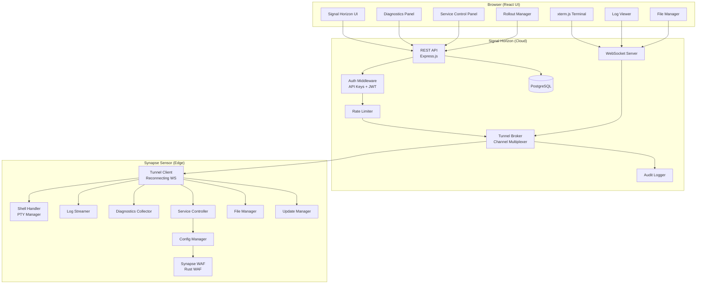
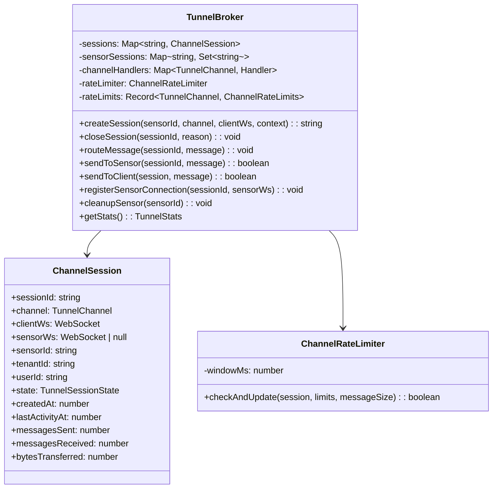
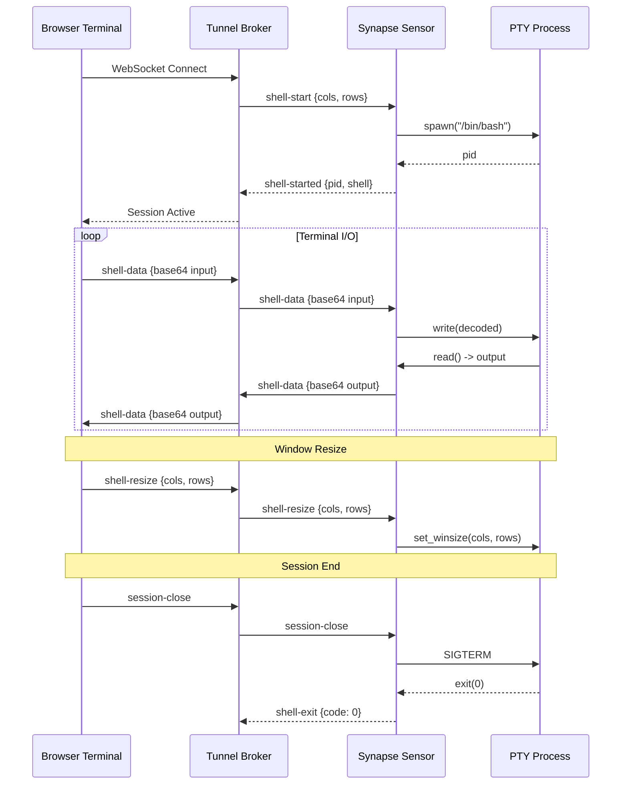
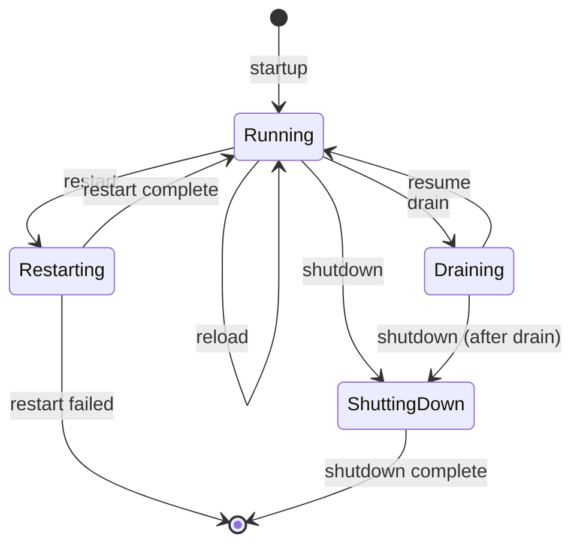
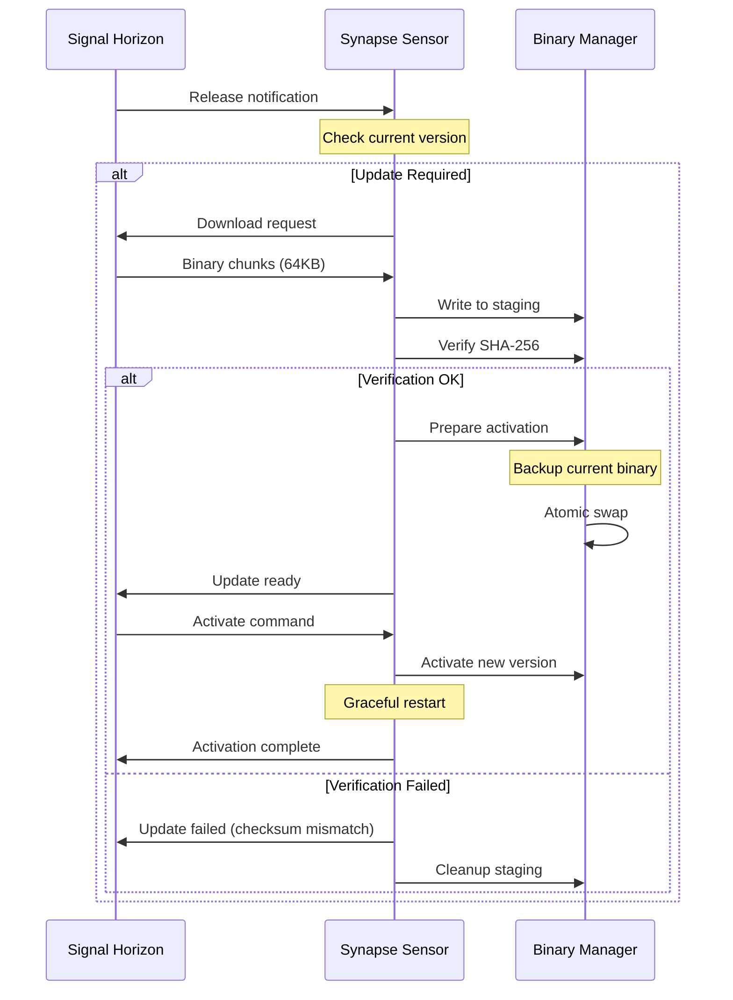
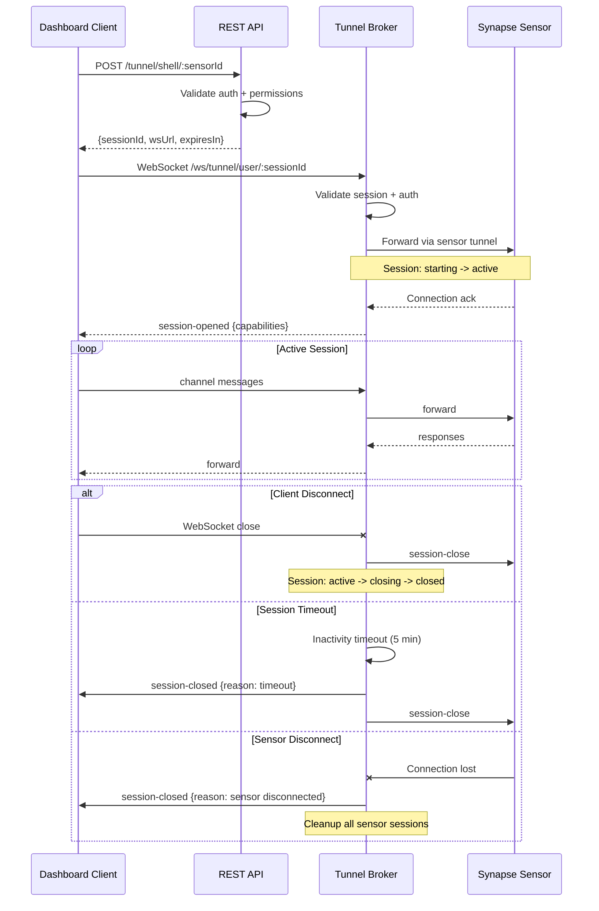
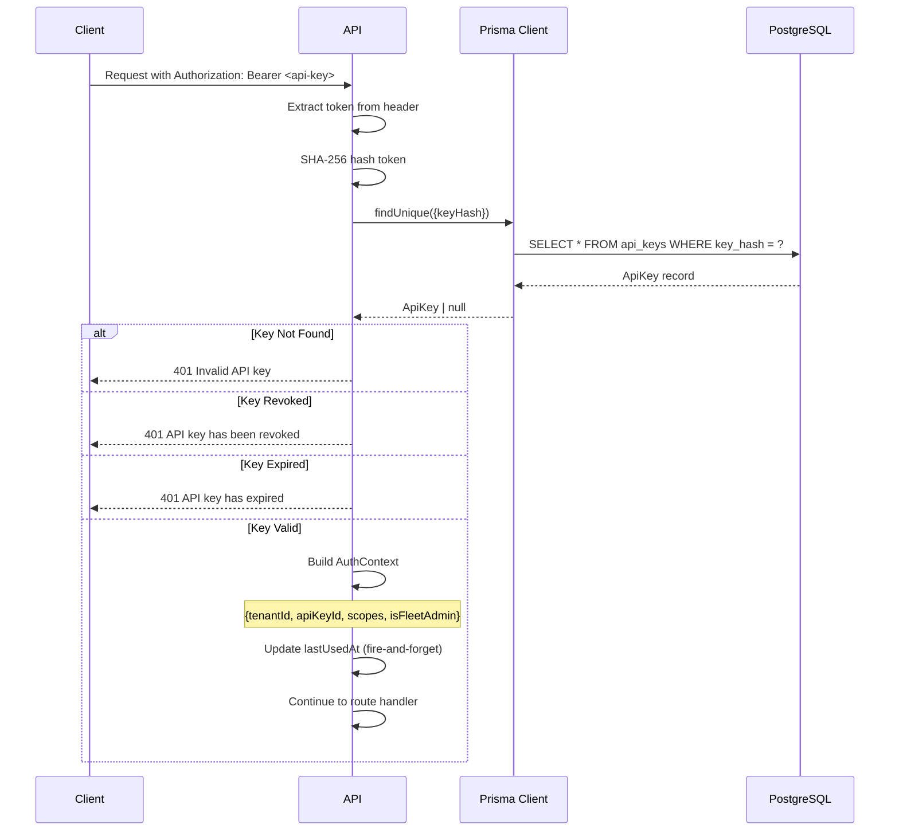
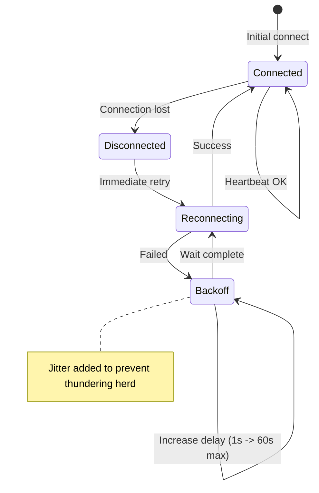
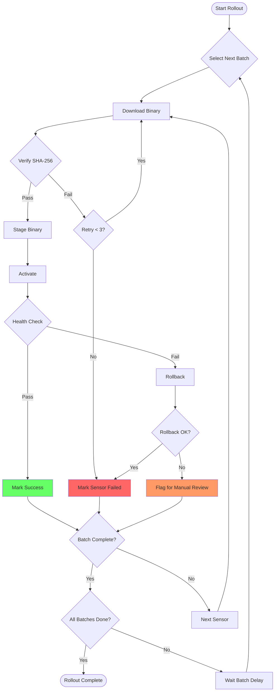
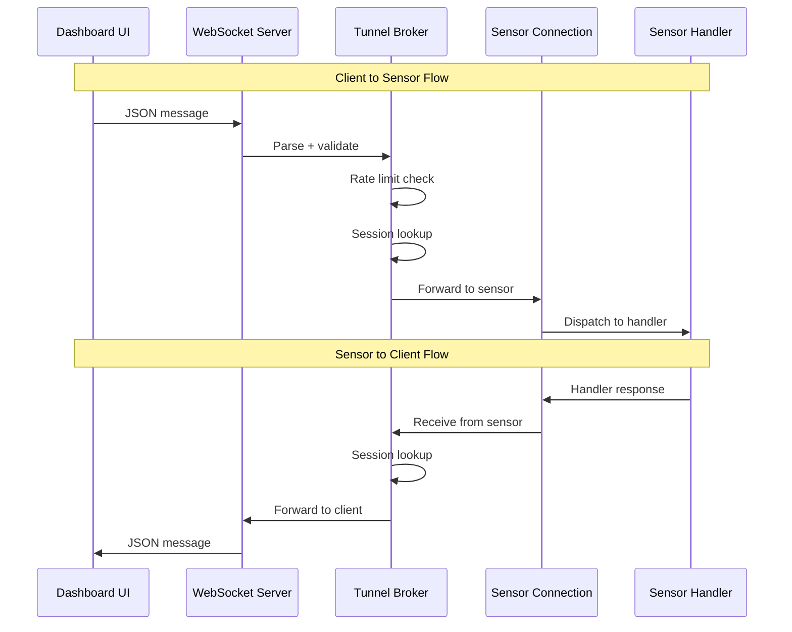

# Remote Management Architecture

This document describes the system architecture for remote sensor management in the Signal Horizon platform, enabling operators to manage distributed Synapse sensors through browser-based interfaces without requiring inbound firewall ports.

## System Overview

Signal Horizon's remote management system provides secure, scalable access to distributed edge sensors through a centralized hub. The architecture uses outbound-only WebSocket tunnels from sensors to enable shell access, log streaming, diagnostics collection, service control, file management, and firmware updates.

### High-Level Architecture



### Key Design Principles

1. **Outbound-Only Connections**: Sensors initiate connections to Signal Horizon, eliminating the need for inbound firewall rules at the edge.

2. **Channel Multiplexing**: A single WebSocket connection supports multiple concurrent channels (shell, logs, diagnostics, control, files).

3. **Session Isolation**: Each user session is isolated with unique identifiers, preventing cross-session data leakage.

4. **Defense in Depth**: Multiple security layers including authentication, authorization, rate limiting, path allowlisting, and audit logging.

5. **Graceful Degradation**: Automatic reconnection, session resumption, and operation queuing during network disruptions.

## Component Details

### Signal Horizon API

The Signal Horizon API is an Express.js application that provides REST endpoints and WebSocket support for remote sensor management.

#### Tunnel Broker Architecture

The `TunnelBroker` class manages tunnel sessions and routes messages between dashboard clients and sensors.



**Key Features**:

- **Session Lifecycle Management**: Sessions transition through states: `starting` -> `active` -> `closing` -> `closed`
- **Per-Channel Rate Limiting**: Configurable limits per channel type (messages/sec, bytes/sec, max sessions)
- **Event-Driven Architecture**: Emits events for session creation, state changes, message routing, and errors
- **Dual Protocol Support**: Supports both new channel-based protocol and legacy protocol for backward compatibility

#### Session Management

Sessions are created through REST API and upgraded to WebSocket connections:

```typescript
// Create session via REST
POST /api/v1/tunnel/shell/:sensorId
POST /api/v1/tunnel/dashboard/:sensorId

// Session response
{
  "sessionId": "uuid",
  "sensorId": "sen_xxx",
  "type": "shell",
  "wsUrl": "/ws/tunnel/user/{sessionId}",
  "expiresIn": 300  // seconds to connect
}

// Upgrade to WebSocket
GET /ws/tunnel/user/:sessionId
```

#### Rate Limiting Implementation

Rate limiting is implemented at multiple levels:

| Level | Implementation | Configuration |
|-------|---------------|---------------|
| API Endpoints | Sliding window per IP | 100 req/min (hunt), 30 req/min (saved queries), 10 req/min (aggregations) |
| Tunnel Channels | Per-session window | Varies by channel type |
| Per-Sensor | Max concurrent sessions | Default: 10 total, varies by channel |

**Default Channel Rate Limits**:

| Channel | Messages/sec | Bytes/sec | Max Sessions |
|---------|-------------|-----------|--------------|
| shell | 100 | 655,360 (10 x 64KB chunks) | 3 |
| logs | 500 | 1,048,576 (1MB) | 5 |
| diag | 10 | 524,288 (512KB) | 2 |
| control | 5 | 65,536 (64KB) | 1 |
| files | 50 | 5,242,880 (5MB) | 2 |

### Synapse WAF (Sensor)

Synapse WAF is the Rust-based WAF sensor that runs at the edge. It includes components for remote management.

#### Tunnel Client with Reconnection

The tunnel client maintains a persistent outbound WebSocket connection to Signal Horizon:

```rust
// Simplified connection flow
pub struct ShadowMirrorClient {
    http_client: Client,
    hmac_secret: Option<String>,
    successes: AtomicU64,
    failures: AtomicU64,
    bytes_sent: AtomicU64,
}

impl ShadowMirrorClient {
    pub async fn send_to_honeypot(
        &self,
        urls: &[String],
        payload: MirrorPayload,
        timeout: Duration,
    ) -> Result<(), ShadowMirrorError> {
        // Round-robin URL selection
        // HMAC signature if configured
        // Fire-and-forget async delivery
    }
}
```

**Reconnection Strategy**:
- Initial connection attempt on startup
- Exponential backoff on failure (1s -> 2s -> 4s -> ... -> 60s max)
- Jitter to prevent thundering herd
- Heartbeat monitoring (30s interval, 60s timeout)

#### Remote Shell (PTY) Implementation

The shell handler spawns a pseudo-terminal (PTY) on the sensor and bridges it to the WebSocket tunnel:



**Shell Data Format**:
- Base64 encoding for binary-safe transport
- Maximum chunk size: 64KB (65536 bytes before encoding)
- Sequence IDs for ordering and deduplication

#### Log Streaming Architecture

Log streaming supports multiple sources with filtering:

```typescript
// Log sources
type LogSource = 'system' | 'sensor' | 'access' | 'error' | 'audit' | 'security';

// Subscription message
interface LogSubscribeMessage {
  channel: 'logs';
  type: 'subscribe';
  sources: LogSource[];
  filter?: {
    minLevel?: LogLevel;
    pattern?: string;       // Case-insensitive text match
    regex?: string;         // Regular expression
    components?: string[];  // Component names
    since?: number;         // Unix timestamp ms
    until?: number;
  };
  backfill?: boolean;
  backfillLines?: number;  // max 1000, default 100
}
```

**Flow**:
1. Client sends `subscribe` message with desired sources and filters
2. Sensor configures log tailing with inotify/kqueue
3. Log entries streamed in real-time with structured fields
4. Optional backfill of historical entries on subscribe
5. Client can `unsubscribe` to stop receiving specific sources

#### Diagnostics Collector

The diagnostics collector gathers system and application metrics on demand:

| Diagnostic Type | Contents |
|----------------|----------|
| `health` | Overall status, uptime, version, component health |
| `memory` | Heap usage, RSS, external memory, GC stats |
| `connections` | Active clients, connection pools, recent connections |
| `rules` | Total rules, enabled/disabled counts, trigger stats |
| `actors` | Tracked threat actors, cache usage, top actors |
| `config` | Current configuration hash, settings |
| `metrics` | RPS, latency percentiles, error rates, bytes in/out |
| `threads` | Worker pool status, pending/completed tasks |
| `cache` | Cache sizes, hit rates, evictions |

**Request/Response Pattern**:
```typescript
// Request
{
  channel: 'diag',
  type: 'request',
  diagType: 'health',
  requestId: 'req-123',
  params: {}  // Optional parameters
}

// Response
{
  channel: 'diag',
  type: 'response',
  requestId: 'req-123',
  data: {
    diagType: 'health',
    status: 'healthy',
    uptime: 864000,
    version: '2.4.2',
    components: [...]
  },
  collectionTimeMs: 12
}
```

#### Service Controller State Machine

The service controller manages sensor lifecycle operations:



**Operations**:

| Operation | Description | Confirmation Required |
|-----------|-------------|----------------------|
| `reload` | Hot-reload configuration without restart | No |
| `restart` | Graceful restart with connection draining | Yes |
| `shutdown` | Graceful shutdown | Yes |
| `drain` | Stop accepting new connections | No |
| `resume` | Resume accepting connections after drain | No |

#### File Manager Security Model

The file manager provides secure file access with strict path allowlisting:

```rust
// Allowed paths (configurable)
const ALLOWED_PATHS: &[&str] = &[
    "/etc/synapse/",          // Configuration files
    "/var/log/synapse/",      // Log files
    "/var/lib/synapse/",      // State files
    "/tmp/synapse-updates/",  // Update staging
];

// Security checks
fn validate_path(path: &str) -> Result<(), FileError> {
    let canonical = canonicalize(path)?;  // Resolve symlinks

    // Must be within allowed paths
    if !ALLOWED_PATHS.iter().any(|p| canonical.starts_with(p)) {
        return Err(FileError::AccessDenied);
    }

    // No path traversal
    if path.contains("..") {
        return Err(FileError::PathTraversal);
    }

    Ok(())
}
```

**Operations**:
- `list`: Directory listing with metadata
- `read`: Chunked file download (64KB chunks, SHA-256 checksum)
- `write`: Chunked file upload with verification
- `stat`: File metadata retrieval

#### Update Manager Workflow

The update manager handles binary updates with rollback support:



**Rollout Strategies**:

| Strategy | Description | Use Case |
|----------|-------------|----------|
| `immediate` | All sensors simultaneously | Critical security patches |
| `canary` | Small subset first, then expand | Risk mitigation |
| `rolling` | Batch-by-batch with configurable delay | Normal updates |

### Signal Horizon UI

The React-based UI provides interfaces for all remote management operations.

#### Component Structure

```
ui/src/
├── components/
│   └── fleet/
│       ├── LogViewer.tsx        # Real-time log viewer
│       ├── RemoteShell.tsx      # xterm.js terminal
│       ├── DiagnosticsPanel.tsx # System diagnostics
│       ├── ServiceControl.tsx   # Start/stop/restart controls
│       ├── FileManager.tsx      # File browser and transfer
│       └── RolloutManager.tsx   # Firmware update management
├── hooks/
│   └── fleet/
│       ├── useRemoteShell.ts    # Shell session management
│       ├── useLogStream.ts      # Log subscription
│       ├── useDiagnostics.ts    # Diagnostics polling/SSE
│       ├── useServiceControl.ts # Service operations
│       ├── useFileTransfer.ts   # File operations
│       └── useReleases.ts       # Rollout management
└── stores/
    └── fleetStore.ts            # Zustand state for fleet UI
```

#### State Management (Hooks)

**useRemoteShell**:
- WebSocket connection lifecycle
- Terminal input/output handling
- Resize event propagation
- Reconnection on disconnect

**useServiceControl**:
```typescript
interface UseServiceControlReturn {
  state: ServiceState;
  activeConnections: number;
  uptime: number;
  isExecuting: boolean;
  executingCommand: ControlCommand | null;
  lastResult: ControlResult | null;
  error: Error | null;

  reload: () => Promise<ControlResult>;
  restart: (confirmed: boolean) => Promise<ControlResult>;
  shutdown: (confirmed: boolean) => Promise<ControlResult>;
  drain: () => Promise<ControlResult>;
  resume: () => Promise<ControlResult>;
  refreshState: () => Promise<void>;
}
```

**useDiagnostics**:
- React Query for polling mode
- SSE (EventSource) for live mode
- Automatic refresh interval (default 5s)
- Demo mode simulation support

**useReleases**:
- Release CRUD operations
- Rollout creation and cancellation
- Progress tracking with status polling
- React Query mutations with optimistic updates

#### Real-Time Updates

**WebSocket** (shell, logs, files):
- Direct WebSocket connections for bidirectional streaming
- Automatic reconnection with exponential backoff
- Message queuing during disconnection

**SSE** (diagnostics live mode):
- EventSource for server-pushed updates
- Automatic reconnection built into browser API
- Fallback to polling if SSE unavailable

**Polling** (diagnostics, rollouts):
- React Query with configurable refetch intervals
- Stale time management for cache optimization
- Background refetch on window focus

## Communication Protocols

### WebSocket Tunnel

The tunnel protocol uses JSON messages with discriminated unions for type safety.

#### Channel Multiplexing

A single WebSocket connection carries all channels:

```
WebSocket Connection
├── Session 1 (shell)
│   ├── shell-start
│   ├── shell-data
│   ├── shell-resize
│   └── shell-exit
├── Session 2 (logs)
│   ├── subscribe
│   ├── entry
│   └── unsubscribe
└── Session 3 (diag)
    ├── request
    └── response
```

Sessions are identified by `sessionId` and isolated at the broker level.

#### Message Format

All messages follow a discriminated union pattern:

```typescript
// Base message
interface TunnelMessageBase {
  channel: TunnelChannel;      // 'shell' | 'logs' | 'diag' | 'control' | 'files'
  sessionId: string;           // UUID
  sequenceId: number;          // Monotonically increasing
  timestamp: number;           // Unix timestamp (ms)
}

// Discriminated by channel + type
type TunnelMessage =
  | ShellMessage      // Shell I/O
  | LogsMessage       // Log streaming
  | DiagMessage       // Diagnostics
  | ControlMessage    // Service control
  | FilesMessage;     // File operations

// Example: Shell data message
interface ShellDataMessage extends TunnelMessageBase {
  channel: 'shell';
  type: 'data';
  data: string;  // Base64 encoded
}

// Example: Control request message
interface ControlRequestMessage extends TunnelMessageBase {
  channel: 'control';
  type: 'request';
  operation: ControlOperation;
  requestId: string;
  params?: {
    timeoutMs?: number;
    force?: boolean;
    gracePeriodMs?: number;
  };
}
```

#### Session Lifecycle



### REST APIs

#### Endpoint Organization

```
/api/v1/
├── fleet/
│   ├── sensors/
│   │   ├── GET /                           # List sensors
│   │   ├── GET /:sensorId                  # Get sensor details
│   │   ├── GET /:sensorId/status           # Get service status
│   │   ├── POST /:sensorId/control         # Execute control command
│   │   ├── GET /:sensorId/diagnostics      # Get diagnostics
│   │   └── GET /:sensorId/diagnostics/stream  # SSE diagnostics
│   ├── releases/
│   │   ├── GET /                           # List releases
│   │   ├── POST /                          # Create release
│   │   └── DELETE /:releaseId              # Delete release
│   └── rollouts/
│       ├── GET /                           # List rollouts
│       ├── POST /                          # Start rollout
│       └── POST /:rolloutId/cancel         # Cancel rollout
└── tunnel/
    ├── GET /status/:sensorId               # Check tunnel status
    ├── POST /shell/:sensorId               # Create shell session
    ├── POST /dashboard/:sensorId           # Create dashboard session
    ├── GET /session/:sessionId             # Get session status
    ├── DELETE /session/:sessionId          # Terminate session
    └── GET /sessions                       # List active sessions
```

#### Authentication Flow



#### Error Handling

Standard error response format:

```typescript
interface ErrorResponse {
  error: string;           // Error type
  message: string;         // Human-readable message
  details?: unknown;       // Additional context
  retryAfter?: number;     // For rate limiting (seconds)
}

// HTTP Status Codes
// 400 - Bad Request (validation errors)
// 401 - Unauthorized (missing/invalid auth)
// 403 - Forbidden (insufficient scope)
// 404 - Not Found (resource not found)
// 429 - Too Many Requests (rate limited)
// 500 - Internal Server Error
// 503 - Service Unavailable (sensor offline)
```

## Security Model

### Authentication

**API Keys**:
- Stored as SHA-256 hashes (never plaintext)
- Scopes define allowed operations
- Expiration dates supported
- Revocation tracked in database
- Last usage timestamp for auditing

**Required Scopes**:

| Operation | Required Scope |
|-----------|---------------|
| View sensors | `fleet:read` |
| Shell access | `fleet:write` |
| Dashboard access | `fleet:read` |
| Service control | `fleet:write` |
| File operations | `fleet:write` |
| Releases/Rollouts | `fleet:admin` |

### Authorization (RBAC Scopes)

```typescript
const SCOPE_HIERARCHY = {
  'fleet:admin': ['fleet:write', 'fleet:read'],
  'fleet:write': ['fleet:read'],
  'fleet:read': [],
};

// Scope check example
function requireScope(...requiredScopes: string[]) {
  return (req, res, next) => {
    const hasScope = requiredScopes.some(scope =>
      req.auth.scopes.includes(scope) ||
      SCOPE_HIERARCHY[scope]?.some(s => req.auth.scopes.includes(s))
    );

    if (!hasScope) {
      return res.status(403).json({
        error: 'Insufficient permissions',
        required: requiredScopes,
        granted: req.auth.scopes
      });
    }
    next();
  };
}
```

### Path Allowlisting for Files

File operations are restricted to predefined safe paths:

```rust
// Default allowed paths
const DEFAULT_ALLOWED_PATHS: &[&str] = &[
    "/etc/synapse/",           // Configuration
    "/var/log/synapse/",       // Logs
    "/var/lib/synapse/",       // State data
    "/tmp/synapse-updates/",   // Update staging
];

// Validation pipeline
fn validate_file_access(path: &str) -> Result<PathBuf, FileError> {
    // 1. Canonicalize to resolve symlinks
    let canonical = fs::canonicalize(path)
        .map_err(|_| FileError::NotFound)?;

    // 2. Check against allowlist
    let allowed = ALLOWED_PATHS.iter()
        .any(|prefix| canonical.starts_with(prefix));

    if !allowed {
        return Err(FileError::AccessDenied {
            path: path.to_string(),
            reason: "Path not in allowlist".to_string(),
        });
    }

    // 3. Reject path traversal attempts
    if path.contains("..") {
        return Err(FileError::PathTraversal);
    }

    // 4. Check file permissions
    let metadata = fs::metadata(&canonical)?;
    if !metadata.permissions().mode() & 0o004 != 0 {
        return Err(FileError::PermissionDenied);
    }

    Ok(canonical)
}
```

### Audit Logging

All sensitive operations are logged with context:

```typescript
interface AuditLogEntry {
  timestamp: string;
  event: string;
  tenantId: string;
  userId: string;
  sensorId?: string;
  sessionId?: string;
  channel?: TunnelChannel;
  operation?: string;
  result: 'success' | 'failure';
  details?: Record<string, unknown>;
  sourceIp: string;
}

// Logged events
const AUDITED_EVENTS = [
  'session:started',
  'session:ended',
  'shell:command',        // Commands executed in shell
  'control:executed',     // Service control operations
  'file:read',
  'file:write',
  'rollout:started',
  'rollout:cancelled',
  'auth:failed',
  'rate_limited',
];
```

## Failure Modes and Recovery

### Tunnel Disconnection Handling



**On Sensor Side**:
- Immediate reconnection attempt on disconnect
- Exponential backoff: 1s, 2s, 4s, 8s, 16s, 32s, 60s (max)
- Jitter: +/- 10% of delay
- Queue outbound messages during reconnection (max 100 messages)
- Discard queued messages if reconnection takes > 5 minutes

**On Hub Side**:
- Mark sensor as offline after heartbeat timeout (60s)
- Close all active user sessions for the sensor
- Notify subscribed dashboards of status change
- Persist queued commands for delivery on reconnection (max 24h)

### Session Timeout Behavior

| Timeout Type | Duration | Behavior |
|--------------|----------|----------|
| Inactivity | 5 minutes | Session closed, user notified |
| Connection | 30 seconds | WebSocket ping/pong failure |
| Auth Token | Configurable | Session closed, re-auth required |
| Max Duration | 8 hours | Hard session limit for security |

### Rollout Failure Recovery



**Automatic Rollback Triggers**:
- Health check failure within 60s of activation
- Crash loop detection (3 restarts in 5 minutes)
- Critical metric degradation (latency P99 > 2x baseline)

**Rollback Process**:
1. Stop accepting new connections (drain)
2. Restore previous binary from backup
3. Restart sensor process
4. Verify health check passes
5. Resume accepting connections
6. Report rollback status to hub

### Rollback Procedures

**Manual Rollback via API**:
```bash
# Cancel active rollout
POST /api/v1/fleet/rollouts/:rolloutId/cancel

# Initiate rollback to previous version
POST /api/v1/fleet/sensors/:sensorId/rollback
{
  "targetVersion": "2.4.1",
  "reason": "Performance regression"
}
```

**Rollback Validation**:
- Previous binary must exist in backup location
- Configuration compatibility check
- Resource availability verification
- Network connectivity to hub

## Performance Characteristics

### Expected Latencies

| Operation | Typical Latency | P99 Latency | Notes |
|-----------|-----------------|-------------|-------|
| Shell keystroke RTT | 20-50ms | 150ms | Depends on network distance |
| Log entry delivery | 10-30ms | 100ms | After sensor collection |
| Diagnostics request | 50-200ms | 500ms | Depends on diagnostic type |
| Control command ack | 100-300ms | 1s | Includes validation |
| File chunk transfer | 50-100ms | 300ms | 64KB chunks |
| Session creation | 200-500ms | 2s | Includes auth + tunnel setup |

### Throughput Limits

| Resource | Limit | Notes |
|----------|-------|-------|
| Concurrent sessions per sensor | 10 | Configurable per channel |
| Log entries per second | 500 | Per subscription |
| Shell data rate | 640KB/s | 10 x 64KB chunks |
| File transfer rate | 5MB/s | Configurable |
| Diagnostics requests | 10/s | Per sensor |
| Control commands | 5/s | Per sensor |

### Resource Usage Estimates

**Signal Horizon (Hub)**:
| Resource | Per Connection | Notes |
|----------|----------------|-------|
| Memory | ~50KB | WebSocket buffers, session state |
| File descriptors | 2 | Client WS + Sensor WS |
| CPU | ~0.1% | Message routing, validation |

**Synapse Sensor (Edge)**:
| Resource | Overhead | Notes |
|----------|----------|-------|
| Memory | ~5MB | Tunnel client, buffers |
| Network | ~1KB/s idle | Heartbeats |
| CPU | <1% | Tunnel maintenance |

**Scaling Estimates**:
- Single hub instance: ~10,000 concurrent connections
- Horizontal scaling: Add instances behind load balancer
- Session affinity required for WebSocket connections

## Diagrams

### Overall System Architecture

See [High-Level Architecture](#high-level-architecture) diagram above.

### Tunnel Message Flow



### Service Control State Machine

See [Service Controller State Machine](#service-controller-state-machine) diagram above.

### Update Workflow

See [Update Manager Workflow](#update-manager-workflow) diagram above.

## Related Documentation

- [Signal Array Architecture](./signal-array.md) - Overall Signal Array system design
- [Remote Access Tutorial](../tutorials/remote-access.md) - User guide for remote access features
- [Sensor Onboarding](../tutorials/sensor-onboarding.md) - Adding sensors to the fleet
- [API Reference](../api.md) - Complete API documentation
- [Sensor Protocol](../sensor-protocol.md) - Sensor communication protocol details
