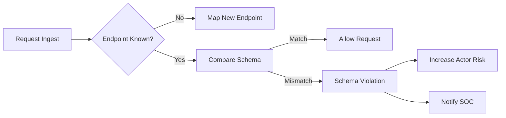

# API Intelligence & Schema Security

This guide explains how Signal Horizon automatically discovers your API surface area and protects it against schema violations and logic abuse.

## Overview

Unlike standard WAF rules that look for generic patterns, **API Intelligence** learns the specific "Normal" behavior of your application's endpoints. It creates a baseline of every JSON field, type, and path to detect anomalies that traditional signatures miss.

## The Discovery & Validation Loop

## 1. Automatic Endpoint Discovery
The Hub's **Aggregator** service continuously monitors request paths. 
- **Normalization**: Paths with unique IDs (e.g., `/api/user/123`) are automatically normalized to templates (e.g., `/api/user/{id}`).
- **Cataloging**: New endpoints appear in the **API Catalog** with their detected HTTP methods and traffic volume.

## 2. Schema Baseline (Learning)
When an endpoint is first discovered, the Hub enters a **Learning Phase**:
- It analyzes the structure of incoming JSON payloads.
- It identifies required vs. optional fields.
- It maps data types (String, Number, Boolean, UUID).
- **Security Note**: Data is analyzed in-memory and summarized; raw PII is never stored in the catalog.

## 3. Schema Violation Detection
Once a baseline is established, any deviation triggers a **Schema Violation** signal:
- **Unexpected Fields**: An attacker adding a `role: admin` field to a registration payload.
- **Type Mismatch**: Sending a string where a number is expected (common in Buffer Overflow probes).
- **Structure Drift**: Major changes to the JSON hierarchy.

## 4. Visualizing Your API Surface
Signal Horizon provides two powerful visualizations for your API:

### API Treemap
Located in **API Intelligence**, this chart uses nested rectangles to show:
- **Size**: Volume of traffic to an endpoint.
- **Color**: Risk level or error rate.
- **Hierachy**: Grouping by service or base path.

### Schema Drift Viewer
When a schema changes (e.g., during a new backend deployment), use the **Drift Viewer** to:
- Compare the **Previous** known schema with the **Current** one.
- Approve the drift to update the baseline.
- Deny the drift if it indicates a malicious injection.

## Best Practices
1. **Approval Workflow**: Regularly review newly discovered endpoints and "Promote" them to protected status.
2. **Low-Volume Alerting**: Set high-sensitivity alerts for sensitive paths like `/api/auth` or `/api/billing`.
3. **Dual-Running**: Monitor Schema Violations in "Log Only" mode for 48 hours after a major API release to avoid false positives.

## Next Steps
- **[Threat Hunting](../guides/rule-authoring-flow.md)**: Search for historic schema violations using SQL.
- **[War Room](../tutorials/war-room-automation.md)**: Automate response to massive schema drift.
