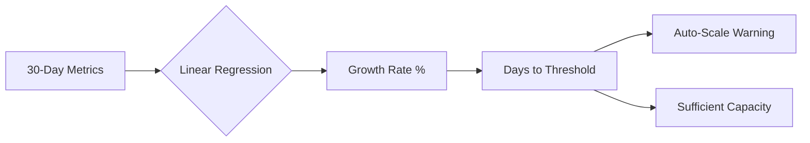

# Capacity Planning & Load Forecasting

This guide explains how to use Signal Horizon's **Capacity Forecasting** dashboard to predict infrastructure needs and avoid performance bottlenecks.

## Overview

Traditional monitoring shows you the current load. Signal Horizon uses a **Linear Regression** model to analyze your fleet's historical traffic trends and predict when a sensor will reach its critical capacity threshold.

## Forecasting Logic

## 1. Understanding the Metrics
We track four primary dimensions for capacity planning:
- **Requests Per Second (RPS)**: Total traffic volume.
- **CPU Utilization**: Processing overhead.
- **Memory Footprint**: State and buffer usage.
- **Disk IOPS**: Logging and database write speed.

## 2. Interpreting the Dashboard

### Growth Trend %
Shows the percentage increase or decrease in traffic compared to the previous period. A consistent >10% growth week-over-week is a strong indicator that additional sensors are needed.

### Days to Threshold (DTT)
The most critical metric. It calculates the date when current growth will hit the **Sensor Capacity Limit** (default: 80%).
- **DTT > 90**: Healthy buffer.
- **DTT < 30**: Planning required.
- **DTT < 7**: Immediate scaling action needed.

## 3. Scaling Strategies

### Horizontal Scaling
If your **Total Fleet RPS** trend is climbing, add more sensors to the load balancer pool.
- **Benefit**: Distributes load, improves redundancy.
- **Metric to watch**: Global RPS Growth.

### Vertical Scaling
If individual sensors are hitting **Memory** or **CPU** limits while RPS is stable, upgrade the sensor instance types (e.g., move from `c5.large` to `c5.xlarge`).
- **Benefit**: Handles complex rule evaluation more efficiently.
- **Metric to watch**: Peak CPU per Sensor.

## 4. Forecasting During Campaigns
Note that during an active **DDoS Attack** or a **Credential Stuffing Campaign**, your forecast may show a sharp spike. 
- **Recommendation**: Filter out the "Attack Period" from your baseline metrics to see the underlying organic growth of your application.

## Next Steps
- **[Fleet Overview](../guides/remote-shell.md)**: Check real-time health of sensors nearing their threshold.
- **[Firmware Updates](../guides/firmware-updates.md)**: Optimize performance by deploying the latest Synapse-Pingora binary.
