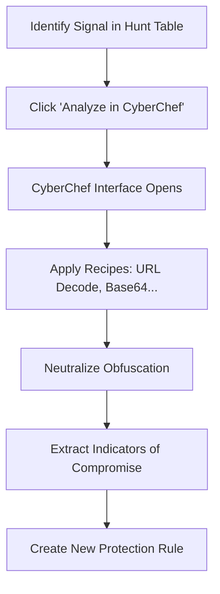

# Forensic Analysis with CyberChef

This tutorial explains how to analyze suspicious request payloads and fingerprints using Signal Horizon's integrated **CyberChef** forensics suite.

## Overview

Modern attacks often use multiple layers of encoding (Base64, URL Encoding, Custom Ciphers) to bypass standard WAF signatures. Signal Horizon allows you to pivot from any detected threat signal directly into CyberChef for deep de-obfuscation and analysis.

## Forensics Workflow

## 1. Pivoting to CyberChef

You can find the **Analyze in CyberChef** button in:
- **Threat Hunting**: Results table entries.
- **War Room**: Evidence locker artifacts.
- **Sensor Logs**: Individual log entry details.

### What gets sent?
- **Raw Payload**: The body of the suspicious request.
- **Metadata**: Fingerprint hashes (JA4, TLS).
- **Environment**: Client IP and Target Host.

## 2. Common Forensic Recipes

CyberChef uses a "Recipe" model to chain operations together. Here are the most useful ones for Signal Horizon data:

| Recipe Name | Use Case |
|-------------|----------|
| **URL Decode** | Revealing path traversal and script injection in URIs. |
| **From Base64** | Decoding payload strings or Authorization headers. |
| **Deflate / Inflate** | Analyzing compressed malware delivery. |
| **Extract IPs** | Pulling upstream target addresses from encoded shells. |
| **JA4 Analysis** | Breaking down fingerprint components for bot detection. |

## 3. Real-World Scenario: De-obfuscating a Shell

If you find a high-risk signal with a payload like `powershell.exe -e JABzAD0A...`:
1. Click **Analyze in CyberChef**.
2. Drag the **From Base64** operation into the Recipe.
3. Drag the **Decode Text (UTF-16LE)** operation.
4. The revealed script shows the attacker's C2 (Command & Control) server URL.
5. Copy the URL and add it to your **Global Blocklist** in Signal Horizon.

## 4. Fingerprint Forensics

Attacker fingerprints (JA4) are also sent to CyberChef. This allows you to verify if a TLS signature matches known automated tools like `sqlmap` or `zgrab`, confirming the request is from a bot even if the IP is rotating.

## Next Steps
- **[Threat Hunting](../guides/rule-authoring-flow.md)**: Search for payloads matching your discovered IOCs.
- **[Rule Authoring](../guides/rule-authoring-flow.md)**: Create permanent blocks based on decoded patterns.
