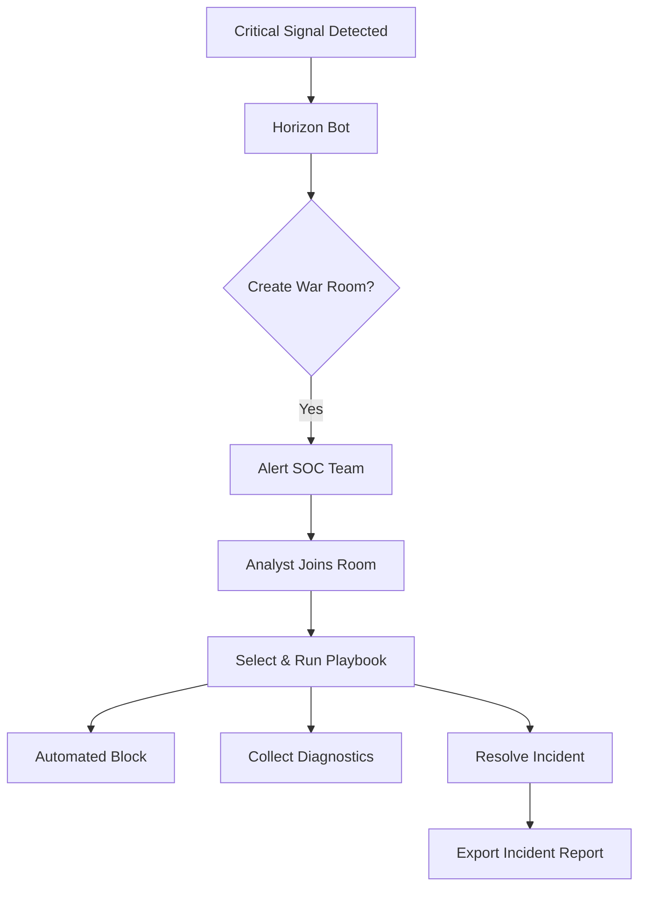

# War Room & Playbook Automation

This tutorial explains how to manage critical security incidents using Signal Horizon's **War Room** and automated **Playbooks**.

## Overview

A War Room is a centralized collaboration space for a specific security incident or campaign. It brings together live telemetry, automated logging via `@horizon-bot`, and step-by-step execution guides called Playbooks.

## Automated Incident Flow

## 1. Initiating a War Room

War Rooms are created in two ways:
1.  **Manual**: Navigate to **SOC Operations** -> **War Room** and click **Create New**.
2.  **Automatic**: Triggered by `@horizon-bot` when a **Critical Severity** signal or a **Cross-Tenant Campaign** is detected.

### Key Components:
- **Activity Log**: A real-time, immutable record of all analyst actions and bot notifications.
- **Evidence Locker**: Linked signals, fingerprints, and IP indicators associated with the threat.
- **Participants**: View who is currently active in the investigation.

## 2. Using Playbooks

Playbooks are predefined "standard operating procedures" (SOPs) that automate repetitive remediation tasks.

### Selecting a Playbook
1. Inside a War Room, click the **Automation** tab.
2. Select a playbook from the library (e.g., "Active SQLi Containment").
3. Review the steps before execution.

### Running a Playbook
Once started, the **Playbook Runner** guides you through each stage:
- **Automated Steps**: These execute immediately (e.g., "Block IP on Fleet").
- **Interactive Steps**: Require analyst confirmation (e.g., "Verify backend health before reload").
- **Verification**: The bot checks if the remediation was successful and logs the result.

## 3. Common Playbooks

| Playbook Name | Trigger | Primary Actions |
|---------------|---------|-----------------|
| **IP Containment** | Credential Stuffing | Global IP Block + Session Revoke |
| **Data Exfil Triage** | DLP Match | Collect Logs + Tarpit IP |
| **System Remediation** | High Error Rate | Test Config + Rollback Version |

## 4. Closing the Incident

When the threat is neutralized:
1. Click **Resolve War Room**.
2. Provide a summary of the root cause and remediation.
3. The Activity Log is archived and available for export as a PDF or JSON for compliance reporting.

## Next Steps
- **[Rule Authoring Guide](../guides/rule-authoring-flow.md)**: Create rules that trigger automation.
- **[Fleet Control](../guides/remote-shell.md)**: Manually inspect sensors mentioned in the War Room.
