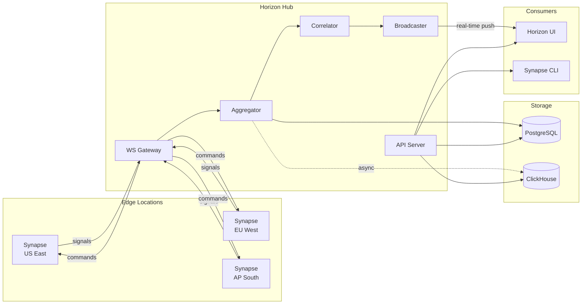

# Architecture

The Horizon platform consists of two primary systems: Synapse WAF engines deployed at the edge and the Horizon hub providing centralized intelligence.

## Platform Overview

## Design Principles

- **Defense in depth** — WAF, DLP, bot detection, behavioral profiling, and session tracking in a single request pipeline
- **Tenant isolation** — all data scoped by tenant ID; cross-tenant correlation uses anonymized SHA-256 fingerprints
- **Real-time correlation** — signals flow from edge to hub in seconds; dashboards update in real time via WebSocket pub/sub
- **Graceful degradation** — Synapse operates independently if the hub is unreachable; ClickHouse failures don't block signal ingestion

## Components

| Component | Role | Details |
| --- | --- | --- |
| **Synapse** | Edge WAF engine | Pure Rust on Pingora. 237 rules, ~10 μs clean GET. [Details →](./synapse) |
| **Horizon API** | Fleet intelligence hub | Signal ingest, correlation, fleet management. [Details →](./horizon) |
| **Horizon UI** | Admin dashboard | Three modules: Synapse (defense), Bridge (deployment), Beam (observability) |
| **PostgreSQL** | Source of truth | Signals, tenants, rules, config, fleet state |
| **ClickHouse** | Historical analytics | Time-series queries, signal aggregation, retention |
| **Redis** | Cache + pub/sub | Session sharing, multi-instance coordination |

## Data Flow

Signals flow from client requests through the Synapse detection pipeline to the Horizon hub. See [Data Flow & Telemetry](./data-flow) for the complete pipeline.
