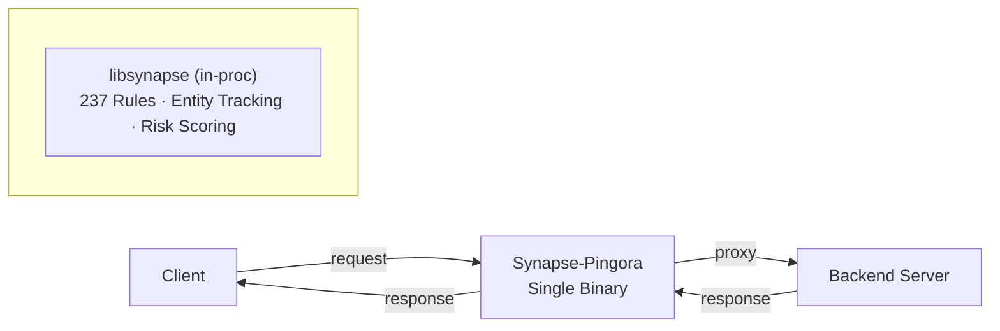
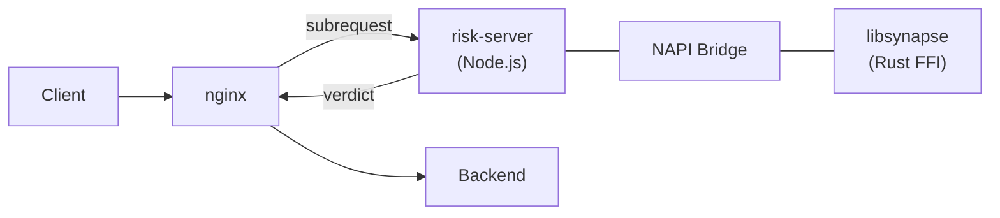
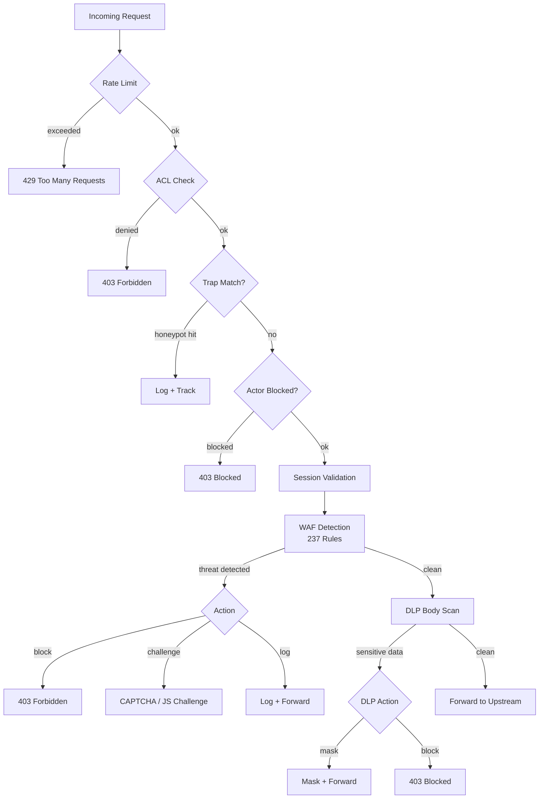

# Synapse WAF Architecture

Synapse is a WAF and reverse proxy built in pure Rust on [Cloudflare Pingora](https://github.com/cloudflare/pingora). Detection runs inside the proxy — no FFI boundary, no separate processes.

## Architecture Comparison

### Synapse-Pingora (Current)

### Legacy Architecture

**Key difference:** 3 components + FFI overhead vs. a single Rust binary with in-process detection.

## Request Processing Pipeline

## Pingora Integration

Synapse uses Pingora's hook system to intercept requests at different stages:

| Hook | Phase | Purpose |
| --- | --- | --- |
| `early_request_filter` | Pre-TLS | Rate limiting per client IP |
| `request_filter` | After headers | WAF detection (main filter) |
| `request_body_filter` | After body | DLP body inspection |
| `upstream_peer` | Routing | Round-robin backend selection |
| `upstream_request_filter` | Pre-upstream | Add `X-Synapse-*` headers |
| `logging` | Post-response | Access logs with timing |

## Thread-Local Engine Design

Each Pingora worker thread has its own Synapse engine instance. This eliminates contention:

- **Lazy rule loading** — rules parsed once at startup via `once_cell::Lazy`
- **Zero-copy headers** — header references passed directly to the engine
- **No shared mutable state** — entity stores use per-worker sharding
- **LTO** — fat link-time optimization in release builds

## Module Inventory

| Module | Purpose |
| --- | --- |
| `waf/` | Core WAF rule engine — 237 rules (SQLi, XSS, path traversal, command injection) |
| `entity/` | IP/fingerprint tracking with cumulative risk scoring |
| `actor/` | Behavioral actor fingerprinting and device identification |
| `session/` | Session tracking, hijack detection |
| `dlp/` | Data Loss Prevention — credit cards, SSN, IBAN, API keys (22 pattern types) |
| `correlation/` | Campaign detection across requests and actors |
| `intelligence/` | Signal intelligence aggregation and management |
| `profiler/` | Endpoint schema learning and behavioral anomaly detection |
| `crawler/` | Bot detection, DNS verification, bad bot blocking |
| `geo/` | GeoIP lookup, impossible travel detection |
| `fingerprint/` | JA4 TLS fingerprinting |
| `shadow/` | Shadow traffic mirroring for safe rule testing |
| `tarpit/` | Progressive delays against malicious actors |
| `telemetry/` | Signal reporting to Horizon hub |
| `tunnel/` | Secure WebSocket tunnel client |
| `horizon/` | Horizon integration and configuration sync |
| `interrogator/` | CAPTCHA, JS challenge, cookie verification |
| `persistence/` | State persistence across restarts |
| `trap/` | Honeypot endpoint detection |
| `ratelimit/` | Per-IP and per-site rate limiting |
| `tls/` | TLS termination with SNI support |
| `vhost/` | Virtual host routing and per-site configuration |

## Performance Characteristics

| Operation | Latency |
| --- | --- |
| Rate limit check | 61 ns |
| ACL evaluation (100 rules) | 156 ns |
| Trap matching | 33 ns |
| Actor is-blocked check | 45 ns |
| Session validation | 304 ns |
| Clean GET detection | ~10 μs |
| Attack detection (avg) | ~25 μs |
| Full pipeline WAF + DLP (4 KB) | ~247 μs |

## Comparison

| Implementation | Detection Latency | Components | Memory |
| --- | --- | --- | --- |
| **Synapse (Pingora)** | ~10–25 μs | 1 binary | Rust only |
| libsynapse (NAPI) | ~62–73 μs | 3 (nginx + Node + NAPI) | Node.js + V8 heap |
| ModSecurity | 100–500 μs | nginx + module | Moderate |
| AWS WAF | 50–200 μs | Cloud service | N/A |
