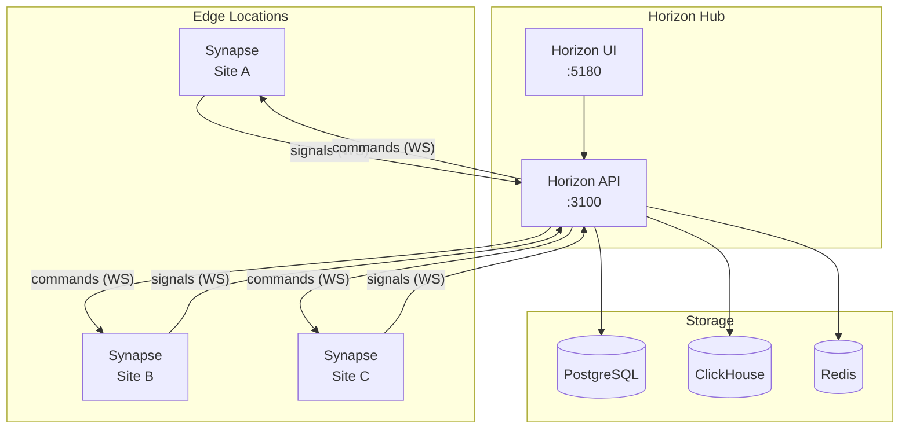

# Deployment

Choose a deployment model based on your needs.

| If you need… | Deploy… | Guide |
| --- | --- | --- |
| A fast WAF, nothing else | Synapse standalone | [Synapse Standalone](./synapse-standalone) |
| Fleet management + analytics | Full Horizon platform | [Deploy Horizon](./horizon) |
| Container orchestration | Kubernetes | [Kubernetes](./kubernetes) |
| Simple containerized setup | Docker Compose | [Docker](./docker) |
| Maximum control | Bare metal / VM | [Deploy Horizon](./horizon) or [Synapse Standalone](./synapse-standalone) |

## Architecture at a Glance

::: info Synapse standalone
When running Synapse without Horizon, the sensor operates independently with a local YAML configuration. No hub connection required.
:::

## Before You Deploy

Review the [Production Checklist](./production) to ensure your environment is hardened, monitored, and ready for traffic.
