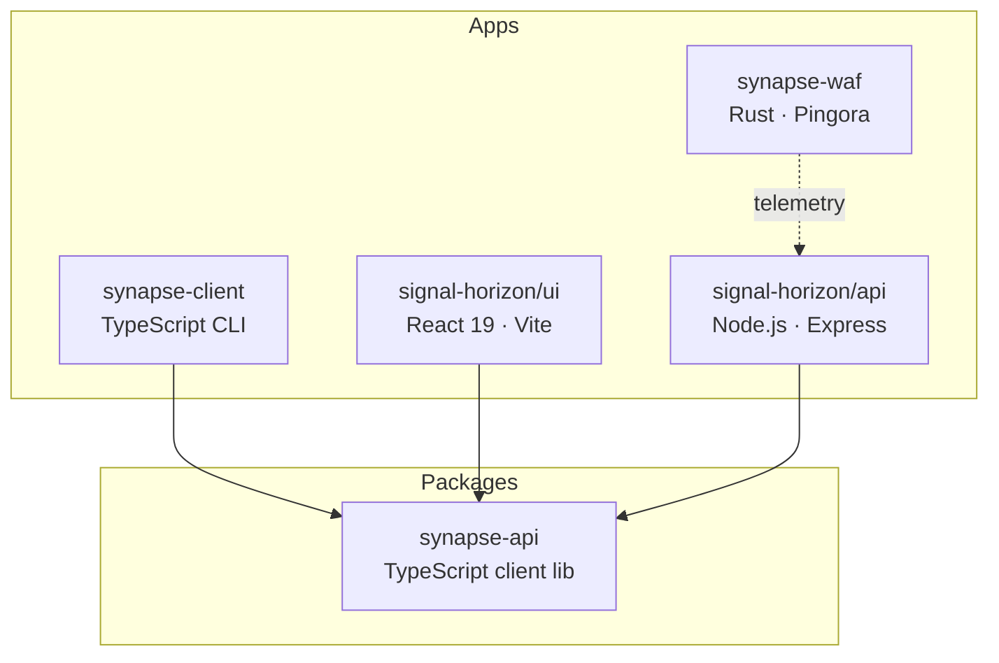

# Development

The Edge Protection monorepo uses pnpm workspaces, Nx for task orchestration, and `just` as a task runner.

## Monorepo Structure

## Tech Stack

| Layer | Technology |
| --- | --- |
| Horizon API | Node.js 20, Express, Prisma, PostgreSQL, ClickHouse |
| Horizon UI | React 19, Vite, Tailwind CSS, Zustand, React Query |
| Synapse WAF | Rust (nightly), Cloudflare Pingora |
| Client tools | TypeScript, synapse-api library |
| Build | pnpm, Nx, Cargo, just |

## Quick Commands

| Task | Command |
| --- | --- |
| Start everything | `just dev` |
| Start Horizon only | `just dev-horizon` |
| Start Synapse only | `just dev-synapse` |
| Build all | `just build` |
| Test all | `just test` |
| Lint all | `just lint` |
| Type-check | `just type-check` |
| Full CI pipeline | `just ci` |
| Check local services | `just services` |

Run `just --list` for the complete recipe catalog.

## Section Guide

| Page | Content |
| --- | --- |
| [Local Environment](./local-setup) | Prerequisites, database setup, service startup |
| [Building](./building) | Build commands for each project, Docker builds |
| [Testing](./testing) | Test suites, integration tests, CI pipeline |
| [Benchmarks](./benchmarks) | Criterion.rs benchmarks, performance testing |
